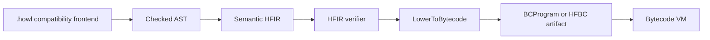

# HFIR Execution Status

## Current canonical representation

The checked AST remains the canonical representation for production source builds. HFIR is a verified semantic graph and now has one explicit executable bytecode-lowering API, but the public `howlframe build` command still uses the legacy AST bytecode compiler.

The direct path is exercised in CI through real parser, checker, verifier, artifact serialization, artifact validation, and isolated VM execution. It is an internal experimental API, not an automatic production-path selector.

## What HFIR actually owns now

`internal/hfir.LowerAST` now gives the Phase-1 subset explicit semantic forms and named operand edges. `internal/hfir.LowerToBytecode(*Graph)` consumes only that graph. It does not accept an AST, recreate `.howl` source, or call `bytecode.CompileToBytecode`. The public contract for this experimental path is to run `Verifier.Verify` before lowering; the lowerer independently rejects malformed references, cycles, and unsupported forms but does not repeat all verifier work.

Semantic information added for this path includes literal kind, explicit program and sequence forms, named bindings and branches, normalized binary operators, dictionary entries, and named value roles. Existing HFIR type, effect, and source-provenance fields remain backend independent.

## What AST still owns

The parser, source expansion, module resolution, patch/context transformations, checker rules, construct-position classification, and public build integration still operate on the AST. The legacy AST bytecode compiler remains the production compiler and still owns all language constructs outside the Phase-1 subset, including function and control-frame layout.

## Phase-1 executable subset

The direct lowerer supports a deterministic `cli_app` subset:

| Category | HFIR forms |
| --- | --- |
| Program and bindings | `program`, `sequence`, `let`, `set`, `if`, symbol reference |
| Values | integer, float, and string constants, `list`, `dict` with explicit key/value entries |
| Expressions | binary arithmetic/comparison/boolean operations, conversions, `str_split`, `str_join`, `list_len`, `map_get`, `list_get` |
| Deterministic mutation | `map_set`, `map_delete`, `append` |
| Observability | `print`, `stderr`, `exit` |
| Capability evidence | `env`, using the existing shared capability authority |

## Unsupported HFIR nodes

Every node outside the subset fails closed with one `HFIR_BYTECODE_UNSUPPORTED` error diagnostic. The diagnostic identifies the offending graph node, target `bytecode`, and available source provenance. It returns no `BCProgram`.

Examples intentionally deferred include `defun`, `call`, `return`, `while`, `for`, `try_let` and `catch`, `parse_json`, `cli_args`, file/network/database/process effects, HTTP routes/lambdas, stores, and model-oriented operations. This is not a claim that those features cannot be represented in HFIR; their current graph forms do not yet preserve all needed semantic roles without AST-shaped recovery.

## Bytecode ownership

The new lowerer owns opcode selection and control-flow jump layout only after semantic HFIR has normalized operand roles. It uses the existing bytecode instruction registry and does not add opcode identifiers to semantic HFIR. The registry remains the bytecode capability source; `internal/capability.ForConstruct` remains the backend-independent HFIR effect authority. There is no separate capability map or capability manifest in `BCProgram`.

The equivalence suite verifies that inferred HFIR capability effects equal capabilities on the newly emitted bytecode instructions for `env`, and that both legacy and direct artifacts fail with the same structured `CAPABILITY_DENIED` error when no grant is supplied.

## Backend status

Only the standalone bytecode backend has this Phase-1 direct HFIR route. Go, JavaScript, Wasm, and the direct interpreter still consume AST or target-specific intermediate forms. No backend was rewritten.

## HowlChangeOps gap

HowlChangeOps passes its current compatibility suite on the baseline AST bytecode path, but its policy is broader than Phase 1.

| Construct group | HFIR representation now | Direct lowering | Blocker | Risk |
| --- | --- | --- | --- | --- |
| Core policy logic | Explicit Phase-1 semantic forms | Supported except `is_nil` | Small single-node addition | Low |
| Inputs and recovery | AST-shaped `cli_args`, `read_file`, `parse_json`, `try_let`, `catch` | Unsupported | Binding, catch, and opaque-source semantics need explicit graph roles | Medium |
| Evidence loop | AST-shaped `for` | Unsupported | Iterator binding and control-flow form | Medium |
| Filesystem effect | Generic current graph node | Unsupported | Deliberate effectful boundary expansion | Medium |

HowlChangeOps needs 23 runtime constructs plus `catch`; Phase 1 does not support a meaningful full policy. Expanding it now would turn the vertical slice into a broad control-flow and error-model migration.

## HowlBoard compatibility

The existing HowlBoard backend compatibility suite passes against the baseline HowlFrame bytecode compiler, including HTTP request parsing, JSON dict/list behavior, stores, CORS, and network/database capability behavior. Its browser test is blocked locally only because Playwright Chromium is not installed. HowlBoard requires functions, routes/lambdas, HTTP response forms, request parsing, stores, and loops, so it remains outside Phase 1. The Phase-1 changes do not alter its production path.

## What must happen before #88

Improvement #88 has a real but deliberately bounded execution destination: model-authored graphs that meet the Phase-1 schema can be verified and lowered directly to a deterministic artifact, while unsupported nodes fail closed. Before a broad adapter can replace `.howl`, HFIR still needs explicit semantic forms for functions, structured error recovery, iteration, opaque effect operations, and stronger graph/control-flow verification. Work on #88 is meaningful as constrained Phase-1 adapter design, but not as a claim that arbitrary model-authored HFIR can execute today.

## Provenance limitation

HFIR-to-bytecode compile diagnostics retain the source filename, line, and column available on their semantic node. Existing runtime `VMError` values identify function, instruction offset, and opcode only; bytecode instructions do not yet carry HFIR provenance. This Phase 1 does not redesign the artifact source-map format.
