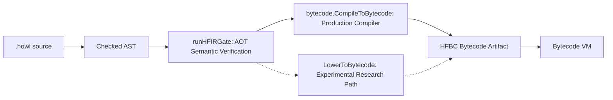

# HFIR Execution Status

## Canonical representation & role freeze (HOWL-CANON-010)

Per canonical remediation baseline finding HOWL-CANON-010, HFIR's architectural role is formally frozen as an ahead-of-time semantic verifier and contract gate (`runHFIRGate`) across all compilation targets. Direct AST compilation via `bytecode.CompileToBytecode` (`howlframe build` / `-compile-bc`) is the production compiler. The direct HFIR-to-bytecode pathway (`-compile-hfir-bc` via `hfir.LowerToBytecode`) is retained strictly as an internal experimental research pathway for bounded Phase-1 `cli_app` programs, not a replacement compiler backend.

```mermaid
flowchart LR
    Source[.howl source] --> AST[Checked AST]
    AST --> Gate[runHFIRGate: AOT Semantic Verification]
    Gate --> ASTComp[bytecode.CompileToBytecode: Production Compiler]
    Gate -.-> Direct[LowerToBytecode: Experimental Research Path]
    ASTComp --> Artifact[HFBC Bytecode Artifact]
    Direct -.-> Artifact
    Artifact --> VM[Bytecode VM]
```

The production path (`-compile-bc` / `howlframe build`) runs the full semantic verification gate ahead of bytecode emission. The direct path (`-compile-hfir-bc`) is an internal experimental API for graph-lowering research.

## What HFIR actually owns now

`internal/hfir.LowerAST` now gives the Phase-1 subset explicit semantic forms and named operand edges. `internal/hfir.LowerToBytecode(*Graph)` consumes only that graph. It does not accept an AST, recreate `.howl` source, or call `bytecode.CompileToBytecode`. The public contract for this experimental path is to run `Verifier.Verify` before lowering; the lowerer independently rejects malformed references, cycles, and unsupported forms but does not repeat all verifier work.

Semantic information added for this path includes literal kind, explicit program and sequence forms, named bindings and branches, normalized binary operators, dictionary entries, and named value roles. Existing HFIR type, effect, and source-provenance fields remain backend independent.

## What AST still owns

The parser, source expansion, module resolution, patch/context transformations, checker rules, construct-position classification, and public build integration still operate on the AST. The legacy AST bytecode compiler remains the production compiler. Phase 3a teaches the experimental lowerer `defun`, `call`, and `return` with the existing `CALL` and `RETURN` opcodes. Phase 3b teaches it `while` with the existing `JUMP_IF_FALSE` and `JUMP` opcodes. Phase 3c teaches it `if` with those same jump opcodes, following control edges. Phase 3d teaches it `for` with the existing `FOR_INIT`, `FOR_NEXT`, and `JUMP` opcodes, following control edges. The rest of the control-frame layout stays on the AST compiler.

## Phase-1 executable subset

The direct lowerer supports a deterministic `cli_app` subset:

| Category | HFIR forms |
| --- | --- |
| Program and bindings | `program`, `sequence`, `let`, `set`, `if`, symbol reference |
| Values | integer, float, and string constants, `list`, `dict` with explicit key/value entries |
| Expressions | binary arithmetic/comparison/boolean operations, conversions, `str_split`, `str_join`, `list_len`, `map_get`, `list_get` |
| Deterministic mutation | `map_set`, `map_delete`, `append` |
| Observability | `print`, `stderr`, `exit` |
| Capability evidence | `env`, using the existing shared capability authority |
| Functions (Phase 3a) | `defun`, `param`, `call`, `return`. Existing `CALL` and `RETURN` opcodes. |
| Loops (Phase 3b) | `while`. Control edges are the condition, then the body. Existing `JUMP_IF_FALSE` and `JUMP` opcodes. |
| Iteration (Phase 3d) | `for`. Control edges are the iterable, then the body. Existing `FOR_INIT`, `FOR_NEXT`, and `JUMP` opcodes. |
| Branches (Phase 3c) | `if`. Control edges are the condition, the then-branch, and an optional else. Existing `JUMP_IF_FALSE` and `JUMP` opcodes. |
| Filesystem writes | `write_file`, `mkdir`. Existing `WRITE_FILE` and `MKDIR` opcodes. Experimental `-compile-hfir-bc` only. |

## Unsupported HFIR nodes

Every node outside the subset fails closed with one `HFIR_BYTECODE_UNSUPPORTED` error diagnostic. The diagnostic identifies the offending graph node, target `bytecode`, and available source provenance. It returns no `BCProgram`.

Phase 3a moved `defun`, `call`, and `return` into the experimental subset. Phase 3b moves `while` in as well: `LowerAST` fills that node's `ControlEdges` with the condition and then the body, and `LowerToBytecode` emits the existing jumps. A `while` without those edges still returns `HFIR_BYTECODE_UNSUPPORTED` and no `BCProgram`. Phase 3c fills `ControlEdges` on `if` with the condition, the then-branch, and an optional else, and the lowerer follows them. An `if` without those edges, or with them swapped, returns `HFIR_BYTECODE_UNSUPPORTED` and no `BCProgram`. Phase 3d fills `ControlEdges` on `for` with the iterable and then the body, and the lowerer follows them with the existing `FOR_INIT`, `FOR_NEXT`, and `JUMP` opcodes. A `for` without those edges, or with them swapped, returns `HFIR_BYTECODE_UNSUPPORTED` and no `BCProgram`. `write_file` lowers to a `path` edge and a `data` edge, and `mkdir` lowers to a `path` edge. The experimental lowerer emits the existing `WRITE_FILE` and `MKDIR` opcodes. A `write_file` without both edges, or a `mkdir` without `path`, returns `HFIR_BYTECODE_UNSUPPORTED` and no `BCProgram`. `match`, `try`, and the other nodes still have empty `ControlEdges`. Examples that remain outside a full CFG include `for` treated as SSA, `try_let` and `catch` where the graph is still not the production source, HTTP routes and lambdas, stores, and model-oriented operations. This is not a claim that the graph is SSA.

## Bytecode ownership

The new lowerer owns opcode selection and control-flow jump layout only after semantic HFIR has normalized operand roles. It uses the existing bytecode instruction registry and does not add opcode identifiers to semantic HFIR. The registry remains the bytecode capability source; `internal/capability.ForConstruct` remains the backend-independent HFIR effect authority. There is no separate capability map or capability manifest in `BCProgram`.

The equivalence suite verifies that inferred HFIR capability effects equal capabilities on the newly emitted bytecode instructions for `env`, and that both legacy and direct artifacts fail with the same structured `CAPABILITY_DENIED` error when no grant is supplied.

## Backend status

Only the standalone bytecode backend has this Phase-1 direct HFIR route. Go, JavaScript, Wasm, and the direct interpreter still consume AST or target-specific intermediate forms. No backend was rewritten.

## HowlChangeOps gap

HowlChangeOps passes its current compatibility suite on the baseline AST bytecode path, but its policy is broader than Phase 1.

| Construct group | HFIR representation now | Direct lowering | Blocker | Risk |
| --- | --- | --- | --- | --- |
| Core policy logic | Explicit Phase-1 semantic forms | Supported except `is_nil` | Small single-node addition | Low |
| Inputs and recovery | AST-shaped `cli_args`, `read_file`, `parse_json`, `try_let`, `catch` | Unsupported | Binding, catch, and opaque-source semantics need explicit graph roles | Medium |
| Evidence loop | `for` with iterable and body control edges | Experimental `-compile-hfir-bc` only | Production path and SSA remain open | Medium |
| Filesystem effect | `write_file` path and data edges, `mkdir` path edge | Experimental `-compile-hfir-bc` only, existing `WRITE_FILE` and `MKDIR` | Production path and the other host effects remain open | Medium |

HowlChangeOps needs 23 runtime constructs plus `catch`; Phase 1 does not support a meaningful full policy. Expanding it now would turn the vertical slice into a broad control-flow and error-model migration.

## HowlBoard compatibility

The existing HowlBoard backend compatibility suite passes against the baseline HowlFrame bytecode compiler, including HTTP request parsing, JSON dict/list behavior, stores, CORS, and network/database capability behavior. Its browser test is blocked locally only because Playwright Chromium is not installed. HowlBoard requires routes and lambdas, HTTP response forms, request parsing, stores, and loops, so it remains outside this experimental subset. Phase 3a covers `defun`, `call`, and `return` on `-compile-hfir-bc` only. Phase 3b covers `while` on that same flag. Phase 3c covers `if` control edges on that same flag. Phase 3d covers `for` control edges on that same flag. The production path is unchanged.

## What must happen before #88

Improvement #88 has a real but deliberately bounded execution destination: model-authored graphs that meet the Phase-1 schema can be verified and lowered directly to a deterministic artifact, while unsupported nodes fail closed. Phase 3a adds source-level `defun`, `call`, and `return` on `-compile-hfir-bc`. Phase 3b adds source-level `while` and that loop's control edges on the same flag. Phase 3c adds source-level `if` control edges on the same flag. Phase 3d adds source-level `for` control edges on the same flag. The model-adapter transport still rejects `defun`, `while`, `for`, `write_file`, and `mkdir`. `if` stays a Phase-1 transport kind, and the schema still has no control-edge field. This slice does not reopen #88. Structured error recovery and a real CFG remain. Work on #88 is still constrained Phase-1 adapter design, not a claim that arbitrary model-authored HFIR can execute today.

## Lowered ABI v1 (improvement #90, phase 1)

`docs/reference/lowered_hfir_abi_v1.md` versions the contract the hosts must share (`lowered-hfir-abi/v1`). The conformance suite compares the interpreter, the bytecode VM, Go, and JavaScript on a pure core and on `env` denial. That comparison runs the production AST paths through `tools/difftest`. It does not switch `-compile-bc` over to `LowerToBytecode`.

Phase 2a mediates `env` in generated Go and JavaScript. An empty `HOWLFRAME_ALLOW_CAPS` grant is `CAPABILITY_DENIED` and does not read the variable. Phase 2b mediates `exec` the same way: an empty grant, or a grant that omits `process`, is `CAPABILITY_DENIED` before any subprocess starts. Phase 2c mediates `read_file` the same way: an empty grant, or a grant that omits `filesystem`, is `CAPABILITY_DENIED` before any filesystem read. Phase 2d mediates `fetch` the same way: an empty grant, or a grant that omits `network`, is `CAPABILITY_DENIED` before any HTTP request. Phase 2e mediates `write_file` and `mkdir` the same way: an empty grant, or a grant that omits `filesystem`, is `CAPABILITY_DENIED` before any file write or directory creation. The production compiler is unchanged.

Wasm feasibility in this revision is the closed set `exec`, `spawn_agent`, and `http_server_start` (`HFIR_TARGET_INFEASIBLE`). Phase 3a makes `defun`, `call`, and `return` executable on `-compile-hfir-bc` only. Phase 3b makes `while` executable on that flag and fills `ControlEdges` for the loop header. Phase 3c fills `ControlEdges` for `if` on that flag. Phase 3d fills `ControlEdges` for `for` on that flag. A dogfood fixture nests `if`, `while`, and `defun` and compares `-compile-hfir-bc` with production `-compile-bc`; the outcomes match, and that comparison does not flip the production compiler. A second dogfood fixture nests `for` with `if`, `while`, and `defun`, including a `for` inside a `for`; those outcomes match too. A third compares `-compile-hfir-bc` with production `-compile-bc` on `write_file` and `mkdir`, granted and denied under `filesystem`, including those effects nested with `if`, `while`, `for`, and `defun`. The outcomes match, including the paths each compiler creates. Production `-compile-bc` is still the AST. The rest of Phase 2 is one lowered graph for every host. #90 stays Partial. Journals: `docs/journals/2026-09-30_lowered_hfir_abi_phase1.md`, `docs/journals/2026-09-30_lowered_hfir_abi_phase2a_env.md`, `docs/journals/2026-09-30_lowered_hfir_abi_phase2b_exec.md`, `docs/journals/2026-09-30_lowered_hfir_abi_phase2c_read_file.md`, `docs/journals/2026-09-30_lowered_hfir_abi_phase2d_fetch.md`, `docs/journals/2026-09-30_lowered_hfir_abi_phase2e_fs_write.md`, `docs/journals/2026-09-30_lowered_hfir_abi_phase3a_defun_call.md`, `docs/journals/2026-09-30_lowered_hfir_abi_phase3b_while.md`, `docs/journals/2026-09-30_lowered_hfir_abi_phase3c_if.md`, `docs/journals/2026-09-30_lowered_hfir_abi_phase3d_for.md`, `docs/journals/2026-09-30_lowered_hfir_abi_dogfood_nested_control.md`, `docs/journals/2026-09-30_lowered_hfir_abi_dogfood_nested_for.md`, `docs/journals/2026-09-30_lowered_hfir_abi_dogfood_fs_write.md`.

## Provenance limitation

HFIR-to-bytecode compile diagnostics retain the source filename, line, and column available on their semantic node. Existing runtime `VMError` values identify function, instruction offset, and opcode only; bytecode instructions do not yet carry HFIR provenance. This Phase 1 does not redesign the artifact source-map format.
